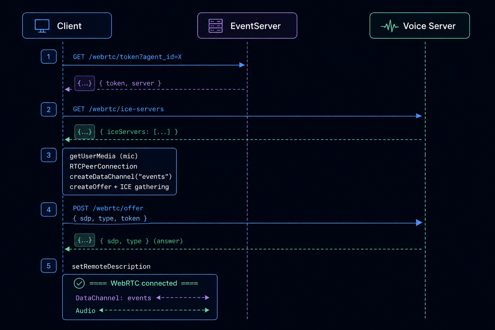

<h1 align="center">@pinecall/voice-core</h1>

<p align="center">
  <strong>Framework-agnostic WebRTC voice session client for Pinecall agents.</strong><br/>
  Zero dependencies. Works with React, Vue, Svelte, vanilla JS, or any framework.
</p>

<p align="center">
  <a href="#install">Install</a> ·
  <a href="#quick-start">Quick Start</a> ·
  <a href="#api-reference">API</a> ·
  <a href="#events-eventtarget">Events</a> ·
  <a href="#datachannel-protocol">Protocol</a> ·
  <a href="#usage-patterns">Framework Patterns</a> ·
  <a href="#typescript-types">Types</a>
</p>

---

## Table of Contents

- [Install](#install)
- [Quick Start](#quick-start)
- [API Reference](#api-reference)
  - [Constructor](#new-voicesessionoptions)
  - [Methods](#methods)
    - [connect](#sessionconnect-promisevoid)
    - [disconnect](#sessiondisconnect-void)
    - [toggleMute](#sessiontogglemute-void)
    - [setMuted](#sessionsetmutedmuted-boolean-void)
    - [getState](#sessiongetstate-readonlyvoicesessionstate)
    - [subscribe](#sessionsubscribelistener---void)
    - [destroy](#sessiondestroy-void)
  - [State](#state)
    - [Call Phases](#call-phases)
    - [Transcript Messages](#transcript-messages)
  - [Events (EventTarget)](#events-eventtarget)
    - [status](#status--connection-status-changed)
    - [phase](#phase--call-phase-changed)
    - [message](#message--transcript-message-added-or-updated)
    - [error](#error--an-error-occurred)
    - [change](#change--any-state-change)
    - [event (raw)](#event--raw-datachannel-event)
  - [DataChannel Protocol](#datachannel-protocol)
    - [Speech Detection (STT)](#speech-detection-stt)
    - [Turn Detection](#turn-detection)
    - [Bot Speech (TTS)](#bot-speech-tts)
    - [Audio Metrics](#audio-metrics)
    - [LLM / Tool Events](#llm--tool-events-via-event-listener)
    - [Client → Server](#client--server-messages)
  - [Usage Patterns](#usage-patterns)
    - [Vanilla JavaScript](#vanilla-javascript)
    - [React](#react-with-usesyncexternalstore)
    - [Vue 3](#vue-3-composable)
    - [Svelte](#svelte-store)
  - [WebRTC Connection Flow](#webrtc-connection-flow)
- [TypeScript Types](#typescript-types)

---

## Install

```bash
npm install @pinecall/voice-core
```

> Zero runtime dependencies. Browser-only (requires `RTCPeerConnection`, `getUserMedia`).

---

## Quick Start

```ts
import { VoiceSession } from "@pinecall/voice-core";

const session = new VoiceSession({ agent: "mara" });

// React-style: subscribe to all state changes
session.subscribe(() => {
  const { status, phase, messages } = session.getState();
  console.log(status, phase, messages);
});

// Or event-style: listen to specific events
session.addEventListener("message", (e) => {
  console.log("New message:", e.detail.message);
});

session.addEventListener("event", (e) => {
  // Raw DataChannel event from the server
  console.log("Raw event:", e.detail);
});

await session.connect();

// Later...
session.disconnect();
```

---

## API Reference

### `new VoiceSession(options)`

Creates a new voice session instance. Does **not** connect automatically.

```ts
interface VoiceSessionOptions {
  /** Agent ID to connect to */
  agent: string;
  /**
   * Pinecall API base URL for token exchange.
   * Default: "https://voice.pinecall.io"
   * Only override for self-hosted deployments.
   */
  server?: string;
}
```

---

### Methods

#### `session.connect(): Promise<void>`

Initiates the WebRTC connection. Full flow:

1. Fetches a short-lived token from `GET /webrtc/token?agent_id=<agent>`
2. Fetches ICE servers from `GET /webrtc/ice-servers` (falls back to Google STUN)
3. Requests microphone access (`getUserMedia`)
4. Creates `RTCPeerConnection`, adds mic track, creates DataChannel
5. Generates SDP offer, gathers ICE candidates
6. Sends offer to `POST /webrtc/offer` with token
7. Sets remote SDP answer → connection established

State transitions: `idle` → `connecting` → `connected` (or `error`).

```ts
await session.connect();
```

#### `session.disconnect(): void`

Closes the WebRTC connection, stops the microphone, clears timers. State returns to `idle`. Messages are preserved.

```ts
session.disconnect();
```

#### `session.toggleMute(): void`

Toggles the microphone. When muted, the audio track is disabled **and** a `{ action: "mute" }` message is sent to the server via DataChannel so it stops processing audio server-side too.

```ts
session.toggleMute();
```

#### `session.setMuted(muted: boolean): void`

Explicit mute/unmute control.

```ts
session.setMuted(true);  // mute
session.setMuted(false); // unmute
```

#### `session.getState(): Readonly<VoiceSessionState>`

Returns the current state snapshot. The reference is **stable** — it only changes when state mutates (safe for `useSyncExternalStore`).

```ts
const { status, phase, messages, isMuted, duration } = session.getState();
```

#### `session.subscribe(listener): () => void`

Subscribes to **all** state changes. Returns an unsubscribe function. Designed for React's `useSyncExternalStore`.

```ts
const unsub = session.subscribe(() => {
  console.log(session.getState());
});

// Later:
unsub();
```

#### `session.destroy(): void`

Disconnects, clears all subscribers, and makes the instance unusable. Call this on component unmount.

```ts
session.destroy();
```

---

### State

```ts
interface VoiceSessionState {
  /** Connection status */
  status: "idle" | "connecting" | "connected" | "error";
  /** Error message (when status is "error") */
  error: string | null;
  /** Whether the microphone is muted */
  isMuted: boolean;
  /** Current call phase — what the conversation is doing right now */
  phase: "idle" | "listening" | "speaking" | "pause" | "thinking";
  /** Whether the user is currently speaking (VAD/STT active) */
  userSpeaking: boolean;
  /** Whether the agent is currently speaking (TTS playing) */
  agentSpeaking: boolean;
  /** Call duration in seconds (updates every second) */
  duration: number;
  /** Full conversation transcript — user + bot messages */
  messages: TranscriptMessage[];
}
```

#### Call Phases

| Phase | Meaning | Triggered by |
|-------|---------|-------------|
| `idle` | Not in a call | Initial state, after disconnect |
| `listening` | Mic is hot, waiting for speech | Connection established, after bot finishes, after turn.resumed |
| `speaking` | Agent is speaking (TTS playing) | First `bot.word` event |
| `thinking` | Processing user input, waiting for LLM | `user.message` (STT final), `turn.end` |
| `pause` | Turn detection pause — user may still be talking | `turn.pause` (brief silence detected) |

#### Transcript Messages

```ts
interface TranscriptMessage {
  /** Unique ID (timestamp-based) */
  id: number;
  /** Who said it */
  role: "user" | "bot";
  /** The text content */
  text: string;
  /** User only: STT is still processing (partial result) */
  isInterim?: boolean;
  /** Bot only: TTS is currently playing this message */
  speaking?: boolean;
  /** Bot only: user interrupted before the message finished */
  interrupted?: boolean;
  /** Bot only: server-assigned ID for word-by-word tracking */
  messageId?: string;
}
```

**Message lifecycle — User:**

1. `user.speaking` → creates message with `isInterim: true`, text updates as STT refines
2. `user.message` → sets `isInterim: false` with final text

**Message lifecycle — Bot:**

1. `bot.speaking` → creates empty message with `speaking: true`
2. `bot.word` (×N) → text builds word-by-word as TTS plays each word
3. `bot.finished` → sets `speaking: false`, optionally replaces text with final version
4. `bot.interrupted` → sets `speaking: false`, `interrupted: true` (user barged in)

---

### Events (EventTarget)

VoiceSession extends `EventTarget`. You can listen to typed custom events:

#### `"status"` — Connection status changed

```ts
session.addEventListener("status", (e: CustomEvent) => {
  console.log(e.detail.status); // "idle" | "connecting" | "connected" | "error"
});
```

#### `"phase"` — Call phase changed

```ts
session.addEventListener("phase", (e: CustomEvent) => {
  console.log(e.detail.phase); // "idle" | "listening" | "speaking" | "pause" | "thinking"
});
```

#### `"message"` — Transcript message added or updated

Fires when a new message is added or an existing one is updated (partial STT, word-by-word bot text).

```ts
session.addEventListener("message", (e: CustomEvent) => {
  const msg = e.detail.message; // TranscriptMessage
  if (msg.role === "user" && !msg.isInterim) {
    console.log("User said:", msg.text);
  }
  if (msg.role === "bot" && !msg.speaking) {
    console.log("Bot finished saying:", msg.text);
  }
});
```

#### `"error"` — An error occurred

```ts
session.addEventListener("error", (e: CustomEvent) => {
  console.error("Voice error:", e.detail.error);
});
```

#### `"change"` — Any state change

Fires on every state mutation. The full state is in `e.detail.state`.

```ts
session.addEventListener("change", (e: CustomEvent) => {
  const state = e.detail.state; // VoiceSessionState
});
```

#### `"event"` — Raw DataChannel event

**This is the power-user event.** Every JSON message from the server's DataChannel is forwarded as-is. Use this to access events that the state machine doesn't expose — like tool calls, function results, audio metrics, or custom events your agent emits.

```ts
session.addEventListener("event", (e: CustomEvent) => {
  const raw = e.detail; // any — the raw JSON from the server
  console.log(raw.event, raw);
});
```

---

### DataChannel Protocol

The WebRTC DataChannel (`"events"`, ordered) carries JSON messages between client and server. The client sends pings and mute/unmute commands. The server sends the following events:

#### Speech Detection (STT)

| Event | Fields | Description |
|-------|--------|-------------|
| `speech.started` | — | User started physically speaking (VAD detected voice) |
| `speech.ended` | — | User stopped speaking (VAD silence) |
| `user.speaking` | `text` | STT partial/interim result — text may change |
| `user.message` | `text` | STT final result — text is locked, turn is over |

#### Turn Detection

| Event | Fields | Description |
|-------|--------|-------------|
| `turn.pause` | — | Brief silence detected — user might still be talking |
| `turn.end` | — | Silence confirmed — user's turn is over, LLM starts |
| `turn.resumed` | — | User started speaking again during the pause |

#### Bot Speech (TTS)

| Event | Fields | Description |
|-------|--------|-------------|
| `bot.speaking` | `message_id`, `text` | TTS generation started. `text` has the full response but the widget intentionally starts empty and builds word-by-word. |
| `bot.word` | `message_id`, `word`, `word_index` | A single word was spoken by TTS. Arrives in real-time as audio plays. |
| `bot.finished` | `message_id`, `text` | TTS completed normally. `text` has the final complete response. |
| `bot.interrupted` | `message_id` | User barged in — TTS was cut short. |

#### Audio Metrics

| Event | Fields | Description |
|-------|--------|-------------|
| `audio.metrics` | `source`, `is_speech`, `level` | Server-side audio analysis. `source` is `"user"` or `"bot"`. |

#### LLM / Tool Events (via `"event"` listener)

These events are **not** processed by the state machine but are forwarded through the `"event"` listener. They come from the Pinecall pipeline's LLM handler:

| Event | Fields | Description |
|-------|--------|-------------|
| `llm.thinking` | — | LLM started generating a response |
| `llm.tool_call` | `tool_name`, `arguments`, `call_id` | LLM requested a tool/function call |
| `llm.tool_result` | `call_id`, `result` | Tool execution result sent back to LLM |
| `llm.response` | `text`, `finish_reason` | LLM finished generating (text may be empty if tool-only) |
| `llm.error` | `error` | LLM error occurred |

**Example — Monitoring tool calls:**

```ts
session.addEventListener("event", (e) => {
  const { event, tool_name, arguments: args, result } = e.detail;

  if (event === "llm.tool_call") {
    console.log(`Agent calling ${tool_name}(${JSON.stringify(args)})`);
  }
  if (event === "llm.tool_result") {
    console.log(`Tool result:`, result);
  }
});
```

#### Client → Server Messages

The client sends these through the DataChannel:

| Message | Format | Description |
|---------|--------|-------------|
| Ping | `"ping"` (string) | Keepalive, sent every 1s |
| Mute | `{ "action": "mute" }` | Stop processing user audio server-side |
| Unmute | `{ "action": "unmute" }` | Resume processing user audio |

---

### Usage Patterns

#### Vanilla JavaScript

```ts
import { VoiceSession } from "@pinecall/voice-core";

const session = new VoiceSession({ agent: "florencia" });

// UI binding
const btn = document.getElementById("call-btn")!;
const transcript = document.getElementById("transcript")!;

btn.onclick = async () => {
  if (session.getState().status === "connected") {
    session.disconnect();
    btn.textContent = "Start Call";
  } else {
    await session.connect();
    btn.textContent = "End Call";
  }
};

session.addEventListener("message", (e) => {
  const msg = e.detail.message;
  const div = document.createElement("div");
  div.className = msg.role;
  div.textContent = `${msg.role}: ${msg.text}`;
  transcript.appendChild(div);
});

session.addEventListener("phase", (e) => {
  document.body.dataset.phase = e.detail.phase;
});
```

#### React with useSyncExternalStore

```tsx
import { useSyncExternalStore, useCallback, useState, useEffect } from "react";
import { VoiceSession } from "@pinecall/voice-core";

function useVoiceSession(agent: string) {
  const [session] = useState(() => new VoiceSession({ agent }));

  const state = useSyncExternalStore(
    useCallback((cb) => session.subscribe(cb), [session]),
    () => session.getState(),
  );

  useEffect(() => () => session.destroy(), [session]);

  return { ...state, session };
}
```

#### Vue 3 Composable

```ts
import { ref, onUnmounted } from "vue";
import { VoiceSession } from "@pinecall/voice-core";

export function useVoiceSession(agent: string) {
  const session = new VoiceSession({ agent });
  const state = ref(session.getState());

  session.subscribe(() => {
    state.value = session.getState();
  });

  onUnmounted(() => session.destroy());

  return { state, session };
}
```

#### Svelte Store

```ts
import { readable } from "svelte/store";
import { VoiceSession } from "@pinecall/voice-core";

export function createVoiceSession(agent: string) {
  const session = new VoiceSession({ agent });

  const state = readable(session.getState(), (set) => {
    return session.subscribe(() => set(session.getState()));
  });

  return { state, session };
}
```

---

### WebRTC Connection Flow

<p align="center">
  
</p>

---

### TypeScript Types

All types are exported from the package:

```ts
import type {
  VoiceSessionOptions,
  VoiceSessionState,
  SessionStatus,    // "idle" | "connecting" | "connected" | "error"
  CallPhase,        // "idle" | "listening" | "speaking" | "pause" | "thinking"
  TranscriptMessage,
} from "@pinecall/voice-core";
```
